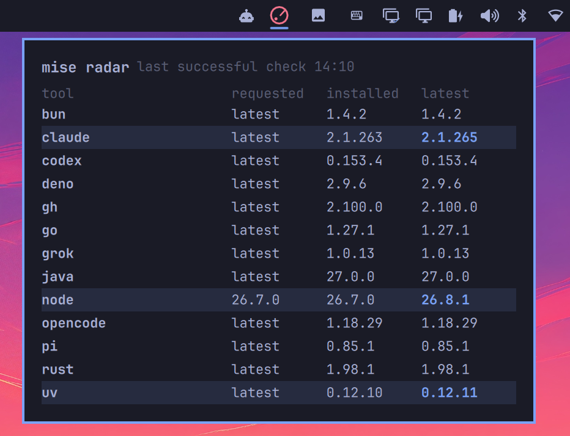

# mise radar

Catch stale mise tools before they bite. Radar watches the versions you actually use on [Omarchy](https://omarchy.org) (Claude, Node, gh, and anything else in `config.toml`) and badges the bar when one falls behind latest. Click for a compact table of requested, installed, and latest, including brand-new releases mise would otherwise hide.



This plugin never upgrades, installs, or writes config.

## Install

```sh
omarchy plugin add https://github.com/chyld/omarchy-mise-radar.git --enable
```

Omarchy already includes mise (`mise-bin`) at `/usr/bin/mise`. The plugin also accepts `$HOME/.local/bin/mise` as a fallback if that distro binary is missing.

## Remove

```sh
omarchy plugin remove chyld.mise-radar
```

That deletes the plugin files. It does not change mise or `~/.config/mise/config.toml`.

## Trust boundary

The plugin launches only `/usr/bin/python3` with this plugin's `supervise.py`. That helper is the process supervisor: it `setsid`s a trusted mise binary into its own session/process group, copies stdout with a 256KiB producer-side ceiling, and on timeout, overflow, SIGTERM/SIGINT/SIGHUP, or replacement it sends SIGTERM to the group, waits 1.5s, then SIGKILL and reaps the tree.

mise itself is never searched on `PATH`. The only accepted binaries, in order, are:

1. `/usr/bin/mise` (Omarchy's `mise-bin` package)
2. `$HOME/.local/bin/mise`

Relative paths, any path containing `..`, and any other location are rejected. Each candidate is probed with `--version` through the supervisor before use. The plugin never launches `sh`, `env`, or `test`, and never uses `curl | sh`.

Commands are argv lists (not a shell), always:

`["/usr/bin/python3", "<plugin>/supervise.py", TIMEOUT, "262144", "1.5", "<mise>", "--", ...]`

- `ls --json --current` (15s supervisor deadline)
- `outdated --bump --json` with `MISE_MINIMUM_RELEASE_AGE=0` inherited into the process environment (45s supervisor deadline; this command may use the network)

QML keeps a slightly longer backup timer, a 256KiB StdioCollector cap, generation tokens, and destruction that SIGTERM's the supervisor then SIGKILL after 1.5s so the helper can reap the group first.

## What it shows

- Quiet radar icon when everything is current
- Count badge when something is behind
- Panel table: tool, requested constraint, installed, latest

Latest comes from `mise outdated --bump`, with `MISE_MINIMUM_RELEASE_AGE=0` so brand-new releases are not hidden. That matches [mise-versions.jdx.dev](https://mise-versions.jdx.dev) more closely than mise's default age filter.

## When it refreshes

On shell start, when you open the panel, and every 4 hours.

## Display-only

It only runs the argv lists above. It never runs `mise upgrade`, `mise install`, `mise use`, or writes `~/.config/mise/config.toml`.

## Development

```sh
node --test tests/model.test.js
/usr/bin/python3 -m py_compile supervise.py
/usr/bin/python3 -m unittest tests.supervise_test
omarchy plugin validate .
```

## License

MIT
